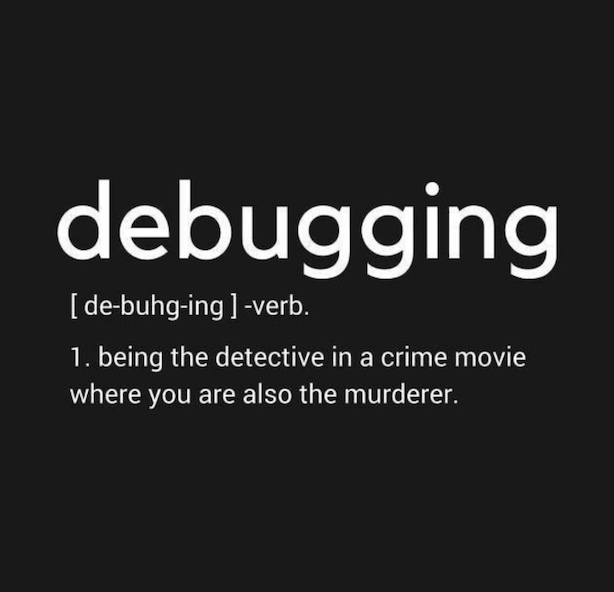
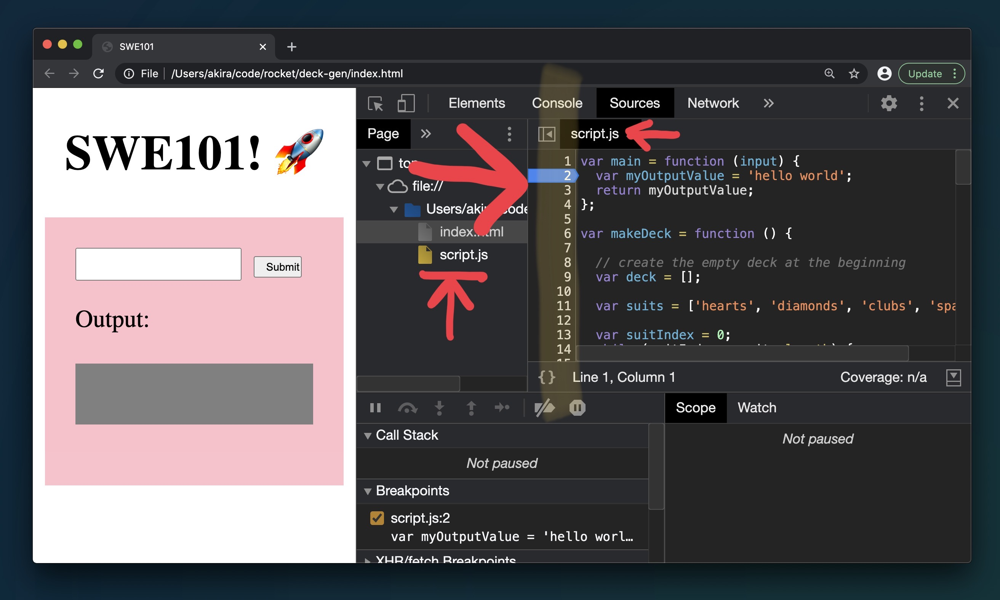
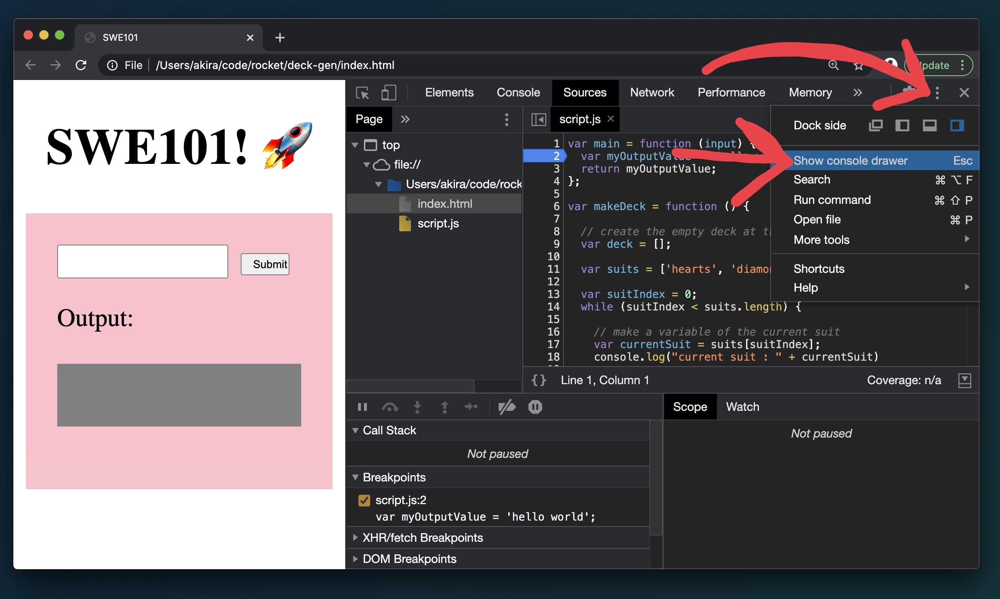
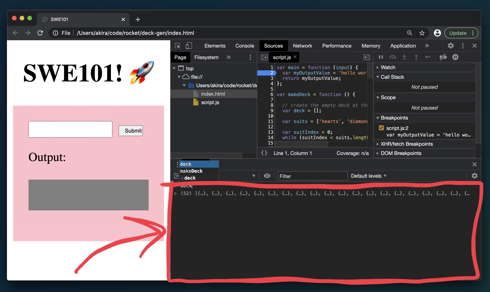
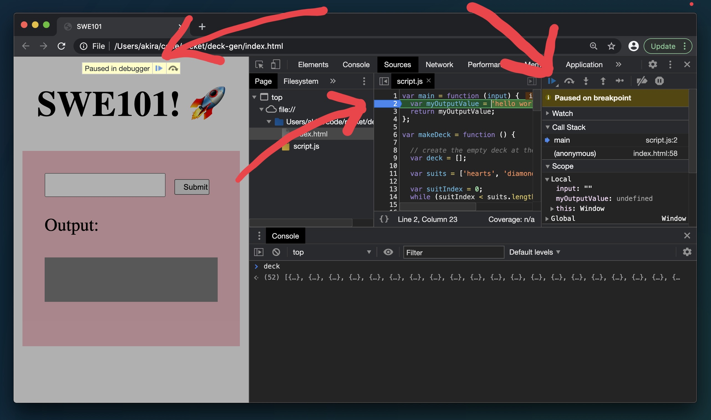

# 10.5: Advanced Debugging with Sources Tab

## Introduction



As your code becomes more complex `console.log`s may not be sufficient to understand what your code is doing or where your errors are coming from.

As always, one of the fundamental goals in the process of building a program is to be able understand all its states and values at each step. You had some intuition or intention about what those states and values were when you wrote the program, but either it's hard to know exactly what they are at each point, or they diverge from what you thought they were. `console.log` allows you to examine the forensics of what the values were when the program ran.

The next level of debugging techniques and tools is the ability to be able to look at the values in your code _**\*as it is running\***_. To be able to press the pause button in the middle of the program and look around at everything and then click to play the program forward again.

### Sources Tab



The sources tab is where the debugging tools live. This tab has many features to it but we will just be covering the bare minimum of it's functionality.

You can refer to the official chrome dev tools guide here if you wish to dive further into the subject: [https://developers.google.com/web/tools/chrome-devtools/javascript](https://developers.google.com/web/tools/chrome-devtools/javascript)

#### Setting a breakpoint

Open the script.js file by clicking in it in the file browser column. Set a breakpoint by clicking in the code file line number column. A blue arrow will appear. Note that you can't edit any code in this view.

#### Looking around with the console

Click the three dots in the upper right hand side to get the dropdown menu. Click on "Show console drawer".

The normal console will appear as a pane below the sources tab.

#### Pause on Debugger / Pressing Play

Run your code to get the debugger to pause. The play arrows that advance the debugger are above the screen and in the control pane of the sources tab.

### Debugging Strategies



### `console.log`

`console.log` should be the default way to try to understand your code. When it seems like you need more precision, or if a console won't be able to cover the breadth of data you need to look at, you can switch to debugger.

### Debugger

Debugger allows you to see into the code exactly when and where you want to. It gives you a level of insight that you can't get only with `console.log`.

## Exercises

### Drawing App Debugging

Open your drawing game and set a breakpoint inside the loop. Open the console to inspect the values at that point. Advance the debugger to see the values as the loop continues.

Use `git clone` to get a copy of [Kai's reference solution for the drawing app. ](https://github.com/kai-rocket/basics-drawing)Open it in the browser and set a breakpoint inside the inner loop. Open the console to inspect the values at that point. Advance the debugger to see the values as the loop continues.
