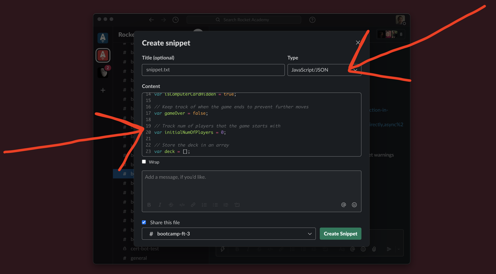

# 💬 Slack

## Introduction

Slack is the app we use to communicate within a section. It provides real-time but asynchronous messaging that should feel casual and fun. **The aim is for a good portion of the course **_**not composed of this website, videos or live meetings**_** happens in your section Slack channel.**

### Slack House Rules

The following are a set of guidelines to follow when using Slack at Rocket. By setting strong culture of messaging on this platform for questions and discussion we hope to further enhance the Rocket Fundamentals experience.

### Ask Questions in the Channel

During Rocket's courses you will have questions about the material. To ensure your questions get answered soonest and so others can help and learn, please ask questions in the batch-wide or section-wide channel (including about installing required software). _**Therefore, please refrain from DMing (direct messaging) instructors with questions about course material.**_

### Provide Context for Questions

To get help effectively, we need to provide context. One of the biggest differences between junior and senior engineers is the amount of relevant context they provide with their questions.

Questions **without context** usually sound like: "_It doesn't work. Could you help?_" A question with **relevant** context might be more like: "_Program A is giving me Error X. I didn't expect X to happen because of Logic B. When I googled X, it told me that this might be related to Y, but I don't see Y anywhere in the system._"&#x20;

Contextual questions help the answerer by filling in the details needed to fully understand the question. In the field of programming (not just for students) it is well known that simply formulating the question often leads directly to the answer. [This is called rubber-duck programming.](https://en.wikipedia.org/wiki/Rubber_duck_debugging)

#### How to ask contextual questions

Try to answer the following when asking questions. What is the problem? Include any relevant error messages in text or screenshots. What is your hypothesis? [Include relevant code snippets, formatted as code in Slack.](./#slack-code-snippets) What have you tried? Include any relevant output or Google results. This will not only assist the person helping you, it will actually make you a better coder.

### Format Code in Slack

When sharing code in Slack, it's best to use Slack's built-in code formatting, which creates code blocks with monospaced text for easier reading. For single-line code like variables or files/folders in regular text, we can use a single backtick (\`) at the start and end of the code to format it.

### Slack Code Snippets

Click the lightning icon to get message options. Type ahead in the box to get the Snippet option.

Make sure that your code will be formatted by selecting the JavaScript type. Note how in a snippet the line numbers are displayed. This makes it easier to discuss the code you put in Slack.

### Use Threads

Slack has the ability to nest contextual messages. When you want to reply to a message's topic, use a thread so that messages stay contextual and others can continue to send messages without interrupting a discussion of a specific topic.
