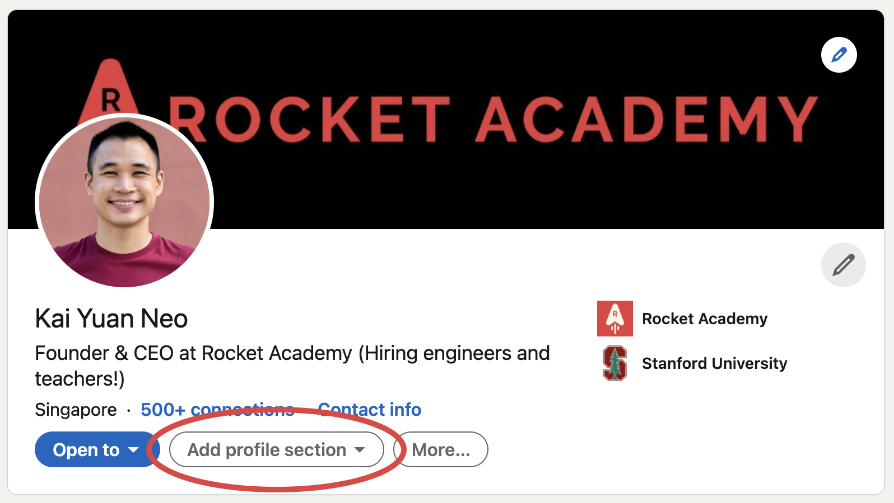
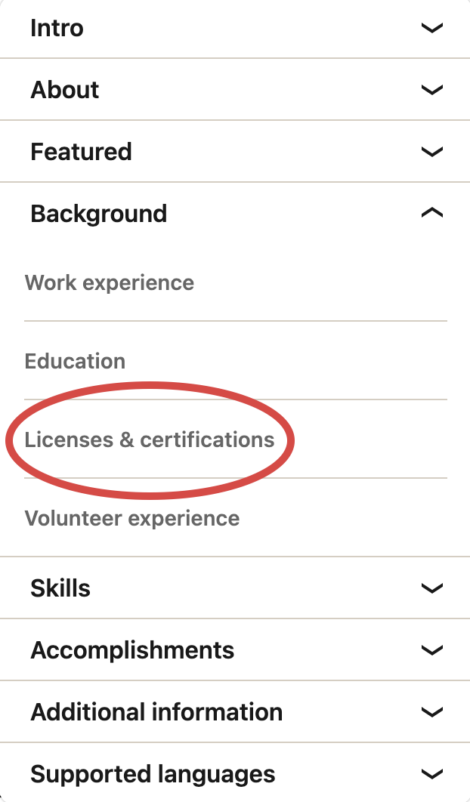

# 🎓 LinkedIn Certificates

At the end of SWE Fundamentals, you will be eligible to add the course as a certification in LinkedIn. Here are instructions on how to add that certificate to your LinkedIn profile.

## 1. Go to your LinkedIn profile page and click "**Add profile section"**

## 2. Click "Licenses & Certifications" to add a new certificate

## 3. Fill in the course name, organisation, \*\*\*\* issue date, and URL

1. Name
   1. Coding Fundamentals
2. Issuing Organization
   1. Rocket Academy
3. Check "This credential does not expire"
4. Issue Date
   1. Your Coding Fundamentals graduation month, e.g. July 2023
5. Credential URL
   1. Your section leader will generate a unique URL for your certificate. Please let us know if you don't have one!

.png>)

## 4. Admire your hard-earned certification 🚀

.png>)

.png>)
