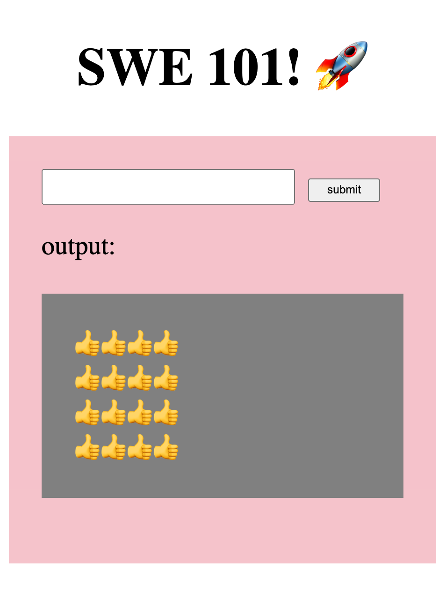
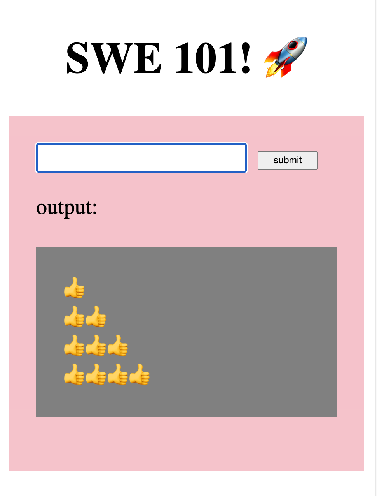

# Day 7: Loops

## Introduction

Today we will practice arrays and loops. For each exercise except Infinite Loop, make a copy of the [starter code](https://github.com/rocketacademy/fundamentals-starter-code).

Pick either one of the Emoji Drawing or Multi-Dice Game exercise and work through from Base to your preferred level of comfort, before attempting the other exercise.



#### Base

Use loops to create an app that draws emojis into the grey box. See [here](https://support.microsoft.com/en-us/windows/windows-10-keyboard-tips-and-tricks-588e0b72-0fff-6d3f-aeee-6e5116097942) for how to input Emoji on Windows and [here](https://support.apple.com/en-sg/guide/mac-help/mchlp1560/mac) for how to input emoji on Mac.

See an example of all problems [**here**](https://rocketacademy.github.io/fundamentals-starter-code/day5/drawingemoji/index.html)**.**

**Number of Characters**

The user will enter a number of characters to display on the screen.

For example, if the user enters 4 they will see this:

.png>)

**Square**

The user will enter the dimensions of a square to display on the screen.

Use a loop within a loop and the ` ` HTML tag in your output to create the square.

For example, if the user enters 4 they will see this:

#### Comfortable

**Triangle**

The user will enter the dimensions of a triangle to display on the screen.‌

Use a loop within a loop, a conditional and the ` ` HTML tag in your output to create the triangle.

For example, if the user enters 4 they will see this:

#### More Comfortable

**Outline Square**

The user will enter the dimensions of a square to display on the screen. The square is outlined by a different character.

For example, if the user enters 4 they will see this:

**Center Square**

The user will enter the dimensions of a square to display on the screen. The square is outlined by a different character and there is another different character in the center. The app doesn't allow dimensions that will not allow the center character.

For example, if the user enters 5 they will see this:




#### Base

More dice rolling and guessing! See an example of all problems [**here**](https://rocketacademy.github.io/fundamentals-starter-code/day5/dicegame/index.html).

1. Create a dice-guessing game with a variable number of dice rolls determined by the user.
2. The game will have 2 modes.
3. In the 1st mode, the user will enter the number of dice they wish to roll.
4. In the 2nd mode, the user will enter a guess that will apply to all dice rolls. For example, if the user has chosen to roll 2 dice in Mode 1 and guesses 4 in Mode 2, that guess of 4 will apply to both Dice 1 and Dice 2.
5. After the user guesses, the program will run a loop where the number of iterations is the number of dice rolls from Mode 1. Each loop iteration will roll a dice and verify if the user has won.
6. If the user guesses correctly for any of the dice rolls, the user wins.
7. The game keeps track of and outputs the overall win-loss record.

#### More Comfortable

**Multi-Round Multi-Dice Game**

1. Alter the previous multi-dice game such that the user plays 4 rounds in the 2nd mode.
2. After the user enters their guess in Mode 2, the program enters a loop that runs 4 rounds.
3. Within each round the game will roll the number of dice the user specified and compare them with the single user guess.
4. If the user guessed correctly for any dice rolls in a round, they win that round.
5. The game will continue to output overall win-loss record, where each of the 4 rounds count as wins or losses.

**Two Player Multi-Round Multi-Dice Game**

1. Change the game to support 2 players, starting with Player 1.
2. The gameplay follows the multi-round multi-dice game above. After each player's turn, that player will have won between 0 and 4 rounds, because each player plays 4 rounds per turn.
3. The game alternates between players indefinitely and outputs win-loss record for each player.

**Multi-Player Multi-Round Multi-Dice Game**

Change the game to ask how many players are playing the game. Players will take turns playing the game as above.



## Reference Solution

[Here ](https://github.com/rocketacademy/basics-drawing/pull/9/files)is a reference solution to the Drawing exercises, and [here](https://github.com/rocketacademy/fundamentals-starter-code/blob/day6/script.js) is a reference solution for Dice Game exercises. Please only view the reference solution for each exercise after you have attempted the exercise yourself. Note that there are many ways to implement these solutions and the reference solution is only 1 way.
