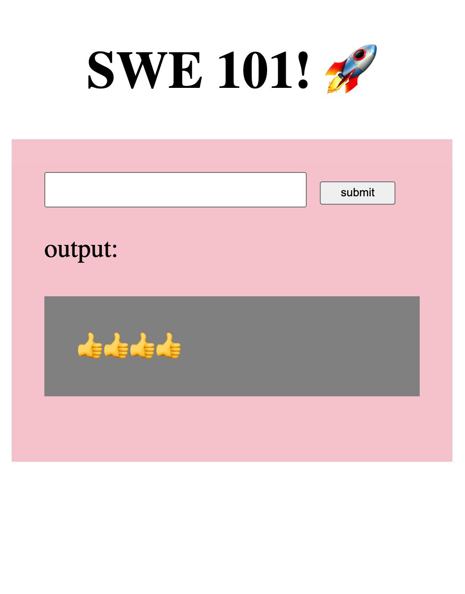
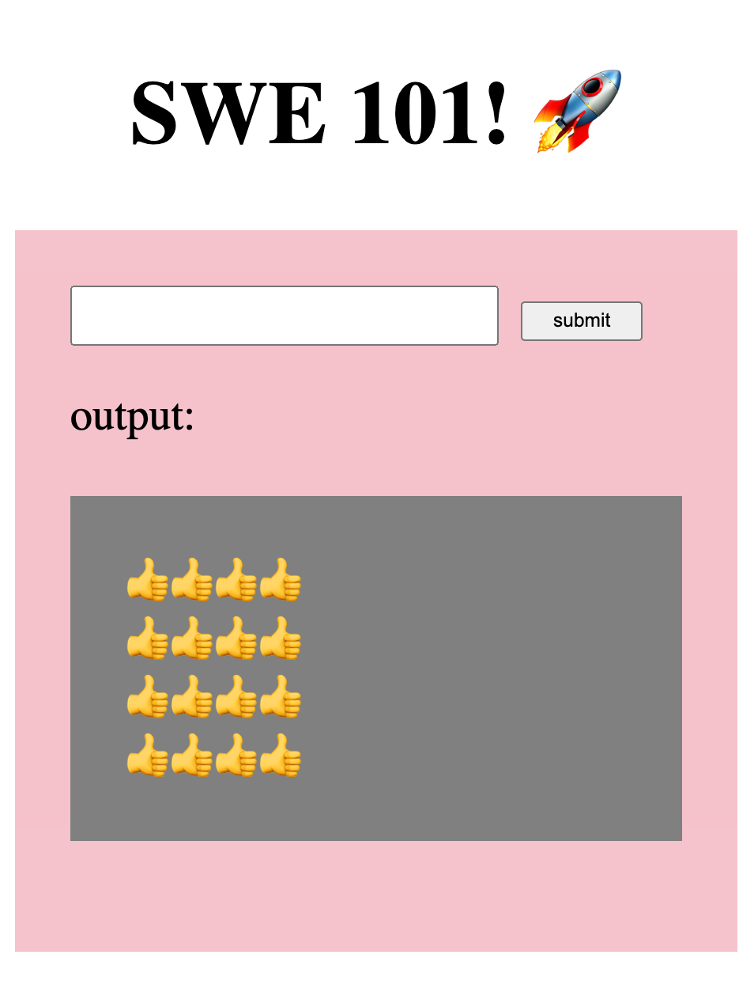
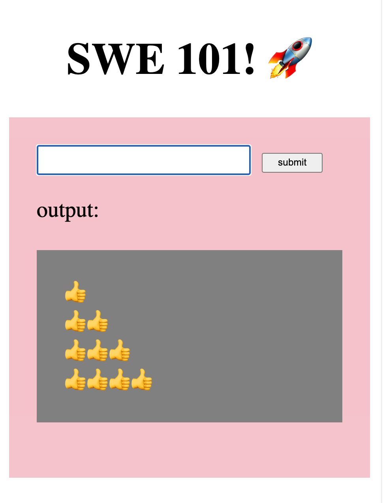
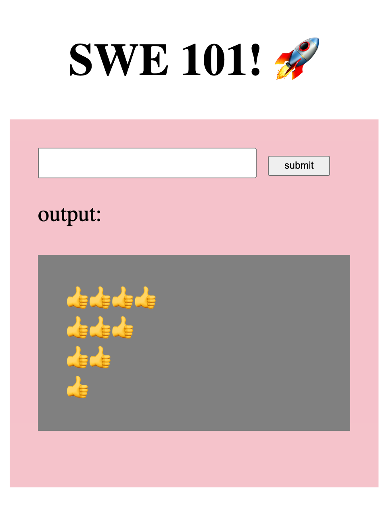
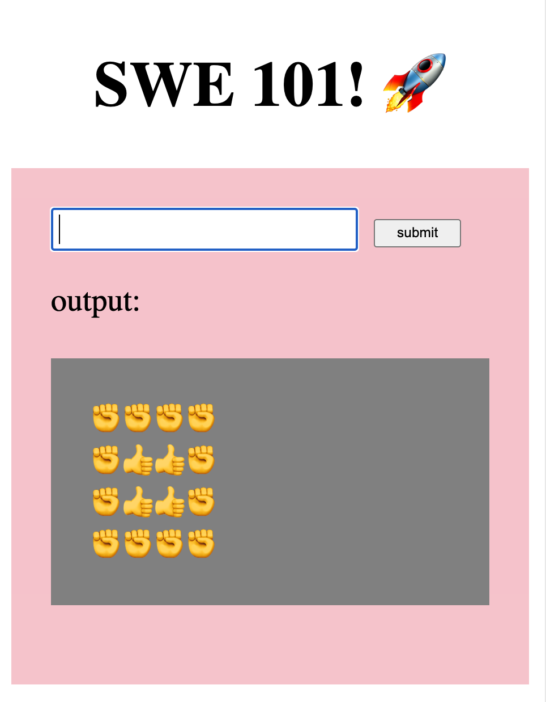
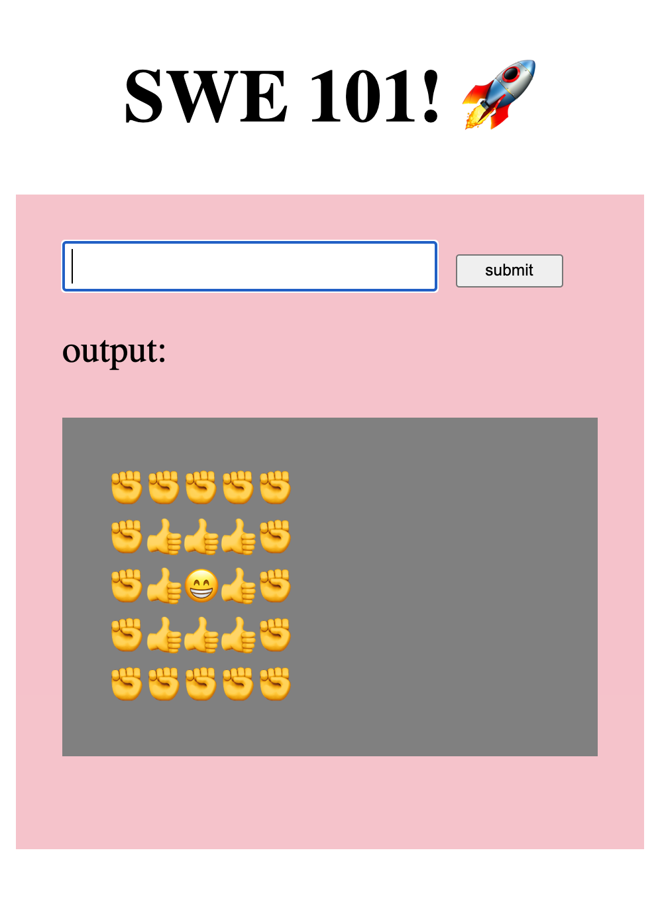

# Drawing With Emojis

Use loops to create an app that draws emojis into the grey box.

Begin the app by **forking** this repo: [https://github.com/rocketacademy/basics-drawing](https://github.com/rocketacademy/basics-drawing)

## Number of Characters

The user will enter a number of characters to display on the screen.

For example, if the user enters 4 they will see this:

## Square

The user will enter the dimensions of a square to display on the screen.

Use a loop within a loop and the ` ` newline HTML tag in your output to create the square.

For example, if the user enters 4 they will see this:

## Triangle

The user will enter the dimensions of a triangle to display on the screen.‌

Use a loop within a loop, a conditional and the ` ` newline HTML tag in your output to create the triangle.

For example, if the user enters 4 they will see this:

## Modes

Add modes to the program so that the user can create any shape- first the user will enter the shape they want, (this is a shape entering mode), e.g., square, triangle, etc. Then the user will enter the dimensions they want.

## More Comfortable

### Upside down Triangle

The user will enter the dimensions of a triangle to display on the screen.

For example, if the user enters 4 they will see this:

### Outline Square

The user will enter the dimensions of a square to display on the screen. The square is outlined by a different character.

For example, if the user enters 4 they will see this:

### Center Square

The user will enter the dimensions of a square to display on the screen. The square is outlined by a different character and there is another different character in the center. The app doesn't allow dimensions that will not allow the center character.

For example, if the user enters 5 they will see this:

### Rings

The user will enter the dimensions of a square to display on the screen. The characters in the square alternate, creating concentric rings.

## Submit

[Push](../8-github/8.2-github-fork-and-clone.md#git-push) the commits in your local repo to GitHub. [Create a pull request](../8-github/8.2-github-fork-and-clone.md#github-pull-request) to submit your assignment. Please fill in the questionnaire in the pull request comments when you submit.

## Reference Solution

Please find a reference solution [here](https://github.com/rocketacademy/basics-drawing/pull/9/files). Note that there are many ways to code solutions to these problems and the reference solution is only 1 way.
