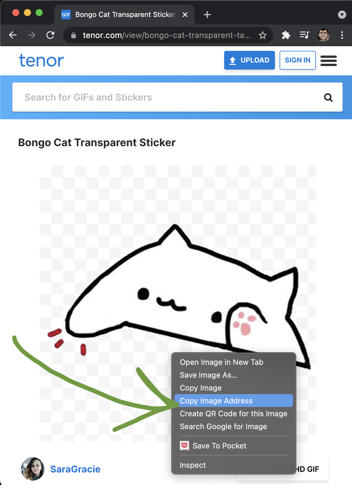
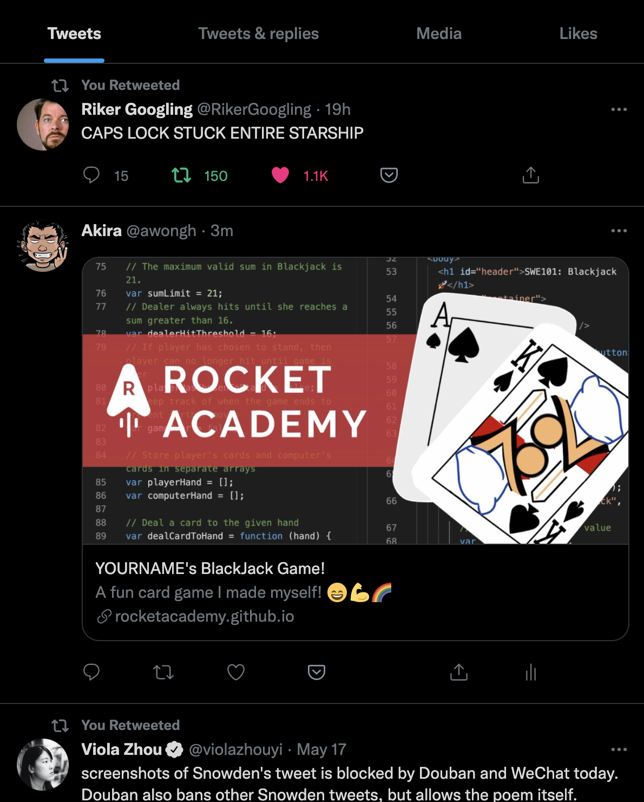
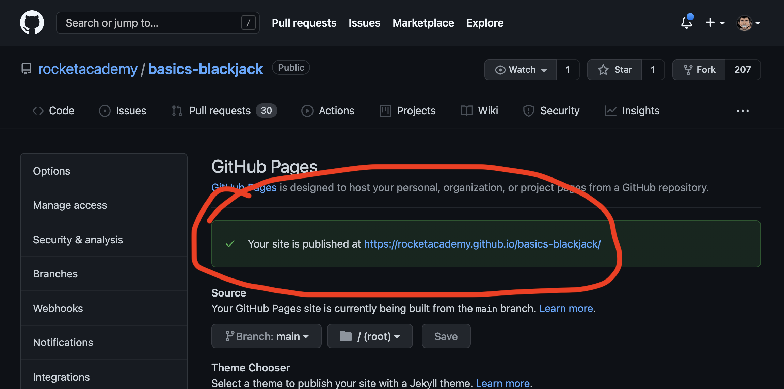

# Project 3: Blackjack

## Introduction

Implement a simplified version of Blackjack. If you're not familiar with Blackjack, refer to [this video](https://www.youtube.com/watch?v=eyoh-Ku9TCI) for game rules. Our simplified rules are the following. Please read all the requirements before starting it!

1. There will be only two players. One human and one computer _(for the Base solution)._
2. The computer will always be the dealer.
3. Each player gets dealt two cards to start.
4. The player goes first, and decides if they want to hit _(draw a card)_ or stand _(end their turn)._
5. The dealer has to hit if their hand is below 17.
6. Each players' score is the total of their card ranks. Jacks/Queen/Kings are 10. Aces can be 1 or 11.
7. The player who is closer to, but not above 21 wins the hand.

## Past Projects

Take a look at some past project as references, and student-voted most-creative projects from previous Batches for inspiration :)



* [Base](https://rocketacademy.github.io/basics-blackjack/)
* [Comfortable 1](https://awongh.github.io/basics-blackjack/index.html)
* [Comfortable 2](https://eggcodes.github.io/basics-blackjack/)
* [Super Comfortable](https://lim-jiahao.github.io/basics-blackjack/)



* [Wall St. Casino](https://supershazwi.github.io/basics-blackjack/)
* [MCU BlackJack](https://aqifsariman.github.io/basics-blackjack/)
* [BlackJack 99](https://liztanyl.github.io/basics-blackjack/)
* [Kawaii BlackJack](https://yingdan7.github.io/basics-blackjack/)
* [Real Cards™ BlackJack](https://waynerbee.github.io/basics-blackjack/)
* [SouthPark Casino](https://ahshawngoh.github.io/basics-blackjack/)
* [Edwin's Casino](https://edwinyxt.github.io/basics-blackjack/)
* [Cheok's Lounge](https://cheoklate.github.io/basics-blackjack/)
* #### [来玩·万辣](https://sherman168.github.io/basics-blackjack/)



* [SouthPark Casino](https://averygan.github.io/basics-blackjack/)
* [Cat-sino](https://thereselyr.github.io/basics-blackjack/)
* [Simple and Green](https://liangtcode.github.io/basics-blackjack/)
* [90's Night](https://yap83.github.io/basics-blackjack/)



## Setup

Begin by forking the [Coding Fundamentals Blackjack repo](https://github.com/rocketacademy/basics-blackjack). Once forked, clone your fork of the repo and work on that copy.

## Base

### Gameplay Description

The `main` function runs on each player's turn. The sequence of actions in the game might be the following.

1. Deck is shuffled.
2. User clicks Submit to deal cards.
3. The cards are analysed for game winning conditions, e.g. Blackjack.
4. The cards are displayed to the user.
5. The user decides whether to hit or stand, using the submit button to submit their choice.
6. The user's cards are analysed for winning or losing conditions.
7. The computer decides to hit or stand automatically based on game rules.
8. The game either ends or continues.


Note that for the `main` function to perform different logic on user input, for example when a player decides to hit or stand, we may wish to consider using a new game mode.


### General Tips

1. Creating helper functions can be a powerful way to refactor your code and keep it neat.
2. Don't be afraid to throw away code, especially if you already know how you would write it better.
3. Commit your code often, whenever you have a small working version. For example, each action listed above would be a commit. Make concise and precise commit messages so that you can reference your old changes later.
4. Review [Coding Strategies](../course-logistics/tips-and-tricks/coding-strategies.md)

### How to Prioritise Work

Given the above \*final\* action sequence to play a full game, how do we break these down into sub-features that we can work on (and verify they are working) one at a time? We want to work on features in small parts, but not have to redo any work as we expand the capability of the game, so we want to plan ahead to make sure we can start small and scaffold in the later features at the same time.

If you already have an effective strategy for creating your game, you can skip ahead. If you're not sure how to approach the game, try applying the following strategies to get started. The following are strategies for breaking down larger projects into smaller tasks to keep up progress, momentum, and motivation on the project. Please read to the end before starting.

#### First Version: Compare Initial Hands to Determine Winner

1. Aim for a playable game. The essence of blackjack requires:
   1. Two players - a player and a dealer _(computer)._
   2. A deck of cards.
   3. A starting hand of 2 cards for each player.
   4. Comparing both hands and determining a winner. The possible scenarios are:
      * A tie. When both the player and dealer have the same total hand values - or if both draw Blackjack
      * A Blackjack win. When either player or dealer draw Blackjack.
      * A normal win. When neither draw Blackjack, the winner is decided by whomever has the higher hand total.
2.  Return appropriate messages. For example:

    ```markdown
    Player hand: Ace of Hearts, King of Spades
    Dealer hand: 8 of Clubs, 8 of Spades
    Player wins by black jack!
    ```
3. Test your code.

#### Second Version: Add Player Hit or Stand

1. The player hitting or standing is different from the dealer hitting or standing. The rules state that the dealer hits or stands after all players are done, so let's work on the players hitting or standing first.
2. The player hitting or standing is a new mode in the game that allows the player to enter their choice. Add the logic for when the player busts _(has a total score of >21)_.
3. Refactor your logic to wait until the player is done to evaluate the game-winning condition.
   * The player should not immediately lose if he busts - there is a possibility he will tie with the dealer if the dealer also busts.
4. Test your code.

#### Third Version: Add Dealer Hit or Stand

1. The rules state that the dealer hits after the player is done. After the player confirms they are done, add the logic for the dealer adding cards to their hand. This should happen before the winning condition.
2. Test your code.

#### Fourth Version: Add Variable Ace Values

1. Add logic to determine whether Aces should have value of 1 or 11 for a given hand.
   *   For example, if a player draws cards in the following order:

       1. "Ace" and "2" _(total 13)_
       2. "4" _(total 17)_
       3. "Ace". _(total 18)_

       The total hand value should be 18, as only ONE of the aces will be counted as 11.
2. Test your code.

## Walkthrough

If you are still unsure how to start, or find yourself stuck for too long, Bryan can walk you through how to get to the Base solution. Please try to attempt the project once yourself before referencing the walkthrough, and do note that the video uses template code straight from [10.2: Card Deck Generation](../9-javascript-objects/9.2-card-deck-generation-with-loops.md). If you would like to follow along exactly, you can start with the [base code](https://github.com/rocketacademy/basics-blackjack/tree/walkthrough-base) used in the walkthrough.


Blackjack Base Walkthrough


The completed base version as per the walkthrough can be viewed [here](https://github.com/rocketacademy/basics-blackjack/blob/walkthrough-base/script.js)!

## Comfortable

### Interface

Improve the look and feel of your game - if you did not attempt the Comfortable version of _Beat That!,_ you can use the[ instructions there](project-2-beat-that.md#comfortable) as a quick-start guide. If you have, feel free to move on, and add your own creative touches.

#### User Instructions

Make the game intuitive and fun to use by adding explicit instructions for each step of the game. "_Wow, you're at 14 right now! Do you want to hit or stand? Type h for hit or s for stand._"

#### Starting Instructions

Add instructions on how to start the game by editing the `index.html`.\
\
Simply add your instructions into [line 134](https://github.com/rocketacademy/basics-blackjack/blob/main/index.html#L134). These instructions will appear when the game loads and will be erased as soon as the user clicks the submit button.

```javascript
<div id="output-div">
  Welcome to Kai's Cards! Click the submit button to get started!
</div>
```

#### Emoji

Use emoji for the card suits ♣️♠️♦️♥️and for the card names 2️⃣. Use more emoji in your game instructions and results. Get creative!

#### Images

You can add images to your game by including an HTML image tag in `myOutputValue`.

```javascript
var myImage = '';
myOutputValue = myOutputValue + myImage; // will display an image in the grey box
```

Image variable template: Fill in the `COPIED_URL_OF_IMAGE` with any image URL you find.

```javascript
var myImage = '';
```

#### Using images

1. Go to a site like [tenor.com](https://tenor.com) for gifs (although _any_ website with images will work)
2. Right-click on an image and copy the url by selecting "Copy Image Address".
3. Paste this value into your code as shown above.



#### Using your own images

Place an image file in your Git repository. Commit the image file and push your image to your GitHub repository.

For example you added an image called `my-image.jpeg` into your repository directory. Refer to it like the following:

```javascript
var myImage = '';
myOutputValue = myOutputValue + myImage; // will display an image in the grey box
```

Image variable template: Fill in the `COPIED_RELATIVE_IMAGE_PATH` with the image file name you uploaded to your repo.

```javascript
var myImage = '';
```

#### Colors

Set your own custom colors in the CSS. Find the color values in `index.html` and change them. Use this tool to find the colors you want: [https://www.w3schools.com/colors/colors\_picker.asp](https://www.w3schools.com/colors/colors\_picker.asp)

Find matching color sets using this design tool: [https://color.adobe.com/create/color-wheel](https://color.adobe.com/create/color-wheel)

#### Fonts

Set your own custom fonts: [https://www.w3schools.com/css/css\_font\_google.asp](https://www.w3schools.com/css/css\_font\_google.asp)

## More Comfortable

### Hide Dealer's First Card

In most casinos, all cards are face-up except the dealer's first card. This injects a dimension of strategy into the game, as the player does not have perfect information to begin with. Edit your game logic such that the player is only told one of the dealer's first two cards.

### Additional HTML Elements

Look ahead to [12.1 Browser Application with DOM](../10-advanced/10.3-browser-applications-with-dom.md) to see how additional HTML elements can be referenced and manipulated; add a button for 'Hit' and 'Stand'.

### Additional Game Logic

Try adding one or more additional game features _(you can also have different versions with different features if implementing all features in one version is too complicated)_:

#### Betting

The player starts with 100 points. Each round the player wagers a number of points before their hand is dealt. Keep track of the player's points throughout the game.

#### Multiplayer

Enable multiple players to play against the dealer, where players can take turns. The game hides and shows relevant hand according to the turn.

#### Splits

Add hand-splitting functionality to the game. If the player has two of the same kind of card, they can choose to split and get dealt 2 new cards. Full splitting rules [here](https://en.wikipedia.org/wiki/Aces\_and\_eights\_\(blackjack\)#Splitting). Dealer is not allowed to split.

## Submit

1. [Push](../8-github/8.2-github-fork-and-clone.md#git-push) the commits in your local repo to GitHub.
2. [Create a pull request](../8-github/8.2-github-fork-and-clone.md#github-pull-request) to submit your assignment.
3. Please leave your name and _**section number**_ in the _**title**_ of the pull request.
4. Please fill in the questionnaire in the pull request comments when you submit.

## Sharing

The cloned BlackJack repo has built-in sharing code. When you share your project with friends on major platforms it will have a nice looking share image.



### Setting the Share Link

Edit the index.html to match the GitHub Pages URL you created in the instructions above.

To have your share link properly link to your page, find your GitHub Pages URL:



Replace the url in the URL section of the meta tags in index.html:

Facebook Share URL: line [30](https://github.com/rocketacademy/basics-blackjack/blob/main/index.html#L30)

```
<meta property="og:url" content="<PUT YOUR URL HERE>index.html">
```

Twitter Share URL: line [37](https://github.com/rocketacademy/basics-blackjack/blob/main/index.html#L37)

```
<meta name="twitter:url" content="<PUT YOUR URL HERE>index.html">
```

#### Sharing text: Put your name and some fun text in the share!

For Facebook / Slack / Whatsapp Shares: edit lines [31 & 32](https://github.com/rocketacademy/basics-blackjack/blob/main/index.html#L31-L32) in the index.html

```
<meta property="og:title" content="YOURNAME's BlackJack Game!">
<meta property="og:description" content="A fun card game I made myself! 😄💪🌈">
```

For Twitter Shares: edit lines [38-42](https://github.com/rocketacademy/basics-blackjack/blob/main/index.html#L38-L42) in the index.html

```
<meta name="twitter:title" content="YOURNAME's BlackJack Game!">
<meta name="twitter:description" content="A fun card game I made myself! 😄💪🌈">
<meta name="twitter:image" content="https://ra-web-files.s3.ap-southeast-1.amazonaws.com/basics/basics-blackjack-share-small.jpeg">
<meta name="twitter:site" content="@rocketacademyco">
<meta name="twitter:creator" content="@rocketacademyco">
```

## Reference Solution

Please only refer to the reference solution after you have attempted the project. Note that there are many ways to implement the project and the reference solution is only 1 way.

1. [Base](https://github.com/rocketacademy/basics-blackjack/tree/base)
2. [Multiplayer](https://github.com/rocketacademy/basics-blackjack/tree/moreComfortable-Multiplayer)


**Rocket Academy does not endorse gambling.** We chose Blackjack as a project because of its complex rules that help facilitate coding instruction.

